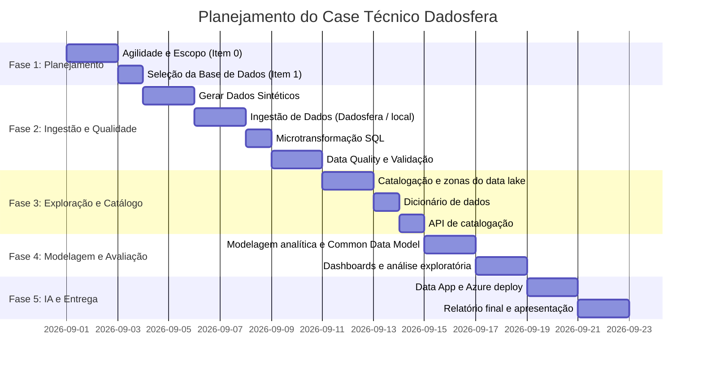
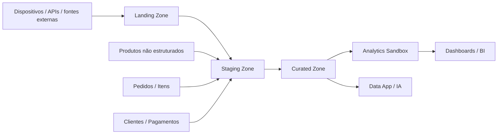

# Case Técnico Dadosfera — Plataforma de Dados para E-commerce

## Sobre o Case

Este projeto foi desenvolvido para atender ao case técnico da Dadosfera, com foco em construir uma plataforma analítica para uma grande empresa de e-commerce. O cenário simula uma operação real de negócios onde a empresa precisa centralizar dados de pedidos, itens, produtos, clientes e eventos de operação para melhorar a tomada de decisão, reduzir perdas, melhorar a experiência do cliente e apoiar decisões prescritivas e analíticas.

A proposta do case é demonstrar, de ponta a ponta, o ciclo de vida dos dados na Dadosfera: integrar, explorar, limpar, catalogar, modelar, visualizar, automatizar e preparar dados para uso em IA e tomada de decisão.

Este repositório foi organizado para cumprir a narrativa do case sem perder rigor técnico, mantendo uma base de dados sintética, realista e reproduzível em ambiente local. O cenário principal é e-commerce com foco em pedidos, itens, catálogo de produtos, qualidade de dados, catalogação e análise analítica.

## Objetivo do projeto

- centralizar dados de operação e comércio eletrônico
- reduzir inconsistências e dados ausentes
- criar um Data Lake estruturado em zonas lógicas
- aplicar microtransformações em dados transacionais
- catalogar ativos e metadados com boas práticas
- aplicar Data Quality com regras e relatórios
- expor dados para dashboards e data app
- demonstrar arquitetura que suporte IA e análise prescritiva

## Visão geral do ciclo de vida dos dados

O projeto segue a visão do ciclo de vida dos dados adotada pela Dadosfera, cobrindo as fases de:

- Integrar
- Processar
- Explorar
- Analisar
- IA / ML
- IAM / segurança
- Data Apps

## Stack proposta

- GitHub: versionamento e documentação
- VS Code: edição dos arquivos, notebooks e versionamento do projeto
- Python + pandas + Faker: geração sintética e processamento local
- Jupyter Notebook: geração de dados e documentação executável
- PostgreSQL / SQL: microtransformação e dados transacionais
- Great Expectations: validação de qualidade
- DataHub / OpenMetadata: catálogo de dados (bonus local)
- Metabase: dashboard local (bonus)
- Streamlit: Data App local implementado em `app.py`; publicação externa ainda pendente
- Google Colab: ambiente de execução exigido pelo case para Python, Data Apps e LLMs; os notebooks são mantidos no repositório e editados no VS Code, mas executados no runtime do Colab
- Azure: opção de cloud para bônus, condicionada à disponibilidade dos créditos; acompanhar consumo e configurar limites para evitar custos após o saldo disponível
- Dadosfera: plataforma oficial do case, quando houver acesso validado

## Governança do projeto

A execução do projeto foi planejada com base em princípios do PMBOK, WBS, gestão de risco, caminho crítico e acompanhamento de dependências.

### WBS (Work Breakdown Structure)

1. Conceito e escopo do caso
2. Escolha da base e desenho do modelo de dados
3. Geração sintética dos dados
4. Ingestão e validação no ambiente da Dadosfera
5. Catálogo e organização das zonas do data lake
6. Quality checks e regras de dados
7. Modelagem analítica e microtransformação
8. Dashboards e data app
9. Entrega executiva e pitch

### Matriz de riscos

| Risco | Categoria | Impacto | Probabilidade | Mitigação |
|---|---|---|---|---|
| Acesso à plataforma Dadosfera indisponível | Operacional | Alto | Média | Validar o que for possível localmente e documentar o que depende do acesso externo. |
| Dados sintéticos não refletirem o domínio | Dados | Alto | Média | Usar cenários plausíveis de e-commerce, transações e produtos com texto livre. |
| Problemas de schema e tipagem | Qualidade | Alto | Média | Validar colunas, tipos e regras antes da análise. |
| Ausência de dados ou campos nulos relevantes | Qualidade | Alto | Média | Aplicar regras de data quality e completar documentação. |
| Atraso em dependências críticas | Prazo | Alto | Média | Manter cronograma por fases e priorizar caminho crítico. |
| Deploy em nuvem indisponível ou limitado | Infraestrutura | Médio | Baixa | Usar Azure free tier ou Streamlit Community Cloud como alternativa. |

### Cronograma e dependências



### Status real por fase em 02/10/2026

| Fase | Status | Evidência / pendência principal |
|---|---|---|
| 1. Iniciação e planejamento | Parcial | Escopo, riscos, custos e baseline documentados; faltam quadro de acompanhamento e datas reais por atividade. |
| 2. Integração e exploração | Parcial | Schema e catálogo local prontos; ingestão/catalogação Dadosfera e prints ainda precisam ser registrados no repositório. |
| 3. Qualidade e processamento | Parcial | GX no Colab passou para 3 tabelas Bronze; processamento LLM real não executado e reviews não fizeram parte desse run. |
| 4. Modelagem e análise | Concluída localmente | Star Schema DuckDB e app local implementados; coleção Metabase/Dadosfera ainda pendente. |
| 5. Pipelines e Data Apps | Parcial | App Streamlit local disponível; pipeline na Dadosfera e deploy público ainda pendentes. |

## Estado validado localmente

A base local já foi validada com evidência direta no ambiente de desenvolvimento:

- `tb_orders.csv`: 100.000 linhas
- `tb_order_items.csv`: 200.000 linhas
- `tb_products_unstructured.csv`: 5.000 linhas

Esses valores atendem ao requisito mínimo de volume do case e foram validados no ambiente local.

> A etapa de ingestão na Dadosfera continua dependente do acesso real ao ambiente da plataforma. O que foi validado localmente é demonstrável e reprodutível no repositório.

## Base de dados proposta

### Domínio

A base proposta é um dataset sintético de e-commerce com foco em pedidos, itens, produtos e comportamento operacional. Ela representa uma operação realista de plataforma de comércio eletrônico com grande volume transacional e dados textuais em produtos não estruturados.

### Tabelas principais

1. `tb_orders`
   - pedido principal
   - status do pedido
   - data de compra
   - data de entrega
   - identificadores de cliente e pedido

2. `tb_order_items`
   - linha de item por pedido
   - quantidade de itens, preço, frete, produto associado

3. `tb_products_unstructured`
   - dados textuais do produto sem estrutura rígida
   - nome, descrição, categoria original, atributos livres

4. `tb_customers` (opcional, bônus)
   - perfil do cliente, região, canal de compra, segmento

5. `tb_payments` (opcional, bônus)
   - forma de pagamento, status, valor, parcelas

6. `tb_reviews` (opcional, bônus)
   - avaliação de clientes e texto de feedback

### Volume recomendado

- `tb_orders`: 100.000 registros
- `tb_order_items`: 200.000 registros
- `tb_products_unstructured`: 5.000 registros
- total final: > 300.000 registros

## Arquitetura da base e dos schemas

### Arquitetura lógica do Data Lake



### Estrutura de zonas sugerida

- Bronze: dados brutos ingeridos diretamente
- Silver: dados limpos, normalizados e validados
- Gold: dados prontos para consumo analítico e IA

### Schema detalhado

#### tb_orders

| Coluna | Tipo | Descrição |
|---|---|---|
| order_id | string | identificador único do pedido |
| customer_id | string | cliente associador |
| order_status | string | status do pedido |
| order_purchase_timestamp | timestamp | data da compra |
| order_delivered_customer_date | timestamp | data de entrega ao cliente |

#### tb_order_items

| Coluna | Tipo | Descrição |
|---|---|---|
| order_id | string | pedido relacionado |
| order_item_id | int | número do item no pedido |
| product_id | string | produto associado |
| price | numeric | preço do item |
| freight_value | numeric | valor do frete |

#### tb_products_unstructured

| Coluna | Tipo | Descrição |
|---|---|---|
| product_id | string | código do produto |
| product_category_name_raw | string | categoria original bruta |
| title_raw | string | título bruto do produto |
| description_raw | string | descrição em texto livre |

#### Common Data Model proposto

```text
Customer
- customer_id
- customer_state
- customer_city
- customer_segment

Order
- order_id
- customer_id
- order_status
- order_purchase_timestamp
- order_delivered_customer_date

OrderItem
- order_id
- order_item_id
- product_id
- quantity
- price
- freight_value

Product
- product_id
- category_name
- title
- description
- attributes_json

Payment
- payment_id
- order_id
- payment_type
- payment_value
- payment_status

Shipment
- shipment_id
- order_id
- shipping_mode
- shipping_cost
- delivery_status
```

## Geração dos dados

O notebook [notebooks/01_data_generation_and_prep.ipynb](notebooks/01_data_generation_and_prep.ipynb) gera os arquivos em `data/bronze/` a partir de regras sintéticas e plausíveis para o cenário de e-commerce.

### Arquivos gerados

- `tb_orders.csv`
- `tb_order_items.csv`
- `tb_products_unstructured.csv`

### Requisitos locais

```bash
pip install -r src/requirements.txt
```

### Validação local do dataset

A validação da base gerada pode ser repetida com o script abaixo:

```bash
python src/validate_generated_data.py
```

Esse script confirma o volume mínimo exigido pelo case e valida as colunas esperadas de cada tabela do bronze.

### Validação já executada localmente

Os dados foram gerados e validados localmente com os seguintes números:

- 100.000 pedidos
- 200.000 itens
- 5.000 produtos

Esses dados foram usados como base para o case e atendem aos requisitos mínimos de volume.

## Item 0 — Agilidade e Planejamento

### Exigência do case

Crie um artefato com planejamento do projeto desde a concepção até a implementação, incluindo PMBOK, WBS, matriz de risco e dependências críticas.

### Entregável

- Gantt com fases do projeto
- risco e mitigação
- interdependências
- caminho crítico
- alocação de recursos e custos estimados

### Entregável neste repositório

Este README reúne o cronograma, estrutura de trabalho, riscos e visão geral do ciclo de vida dos dados. O planejamento está documentado no início desta página.

#### Recursos e estimativa de custos

Premissas do planejamento: execução individual pela pessoa candidata; uso de ferramentas locais e planos gratuitos enquanto disponíveis; deploy em Azure somente como bônus e após estimativa no calculador oficial.

| Recurso | Alocação | Estimativa de custo direto |
|---|---|---|
| Pessoa candidata, atuando como analista de dados e responsável pelo projeto | Planejamento, geração, validação, modelagem, visualização e documentação | Sem custo financeiro contabilizado neste case; esforço será registrado em horas durante a execução. |
| VS Code, Python, pandas e Faker | Desenvolvimento e execução local | R$ 0 em licenças, usando as versões comunitárias. |
| Google Colab | Execução dos notebooks conforme o case | R$ 0 no plano gratuito, sujeito aos limites e à disponibilidade do serviço. |
| Dadosfera | Ingestão e catalogação no ambiente de treinamento | Acesso disponibilizado para o case; sem custo direto previsto para a pessoa candidata. |
| Azure | Hospedagem opcional do Data App | Usar até R$ 200 em créditos disponíveis; custo final depende do serviço, região e tempo ligado e deve ser calculado antes do deploy. |

Não iniciar recursos Azure antes de conferir a estimativa, configurar alertas de orçamento e definir como interromper ou remover os recursos. Os créditos não garantem custo zero depois que o saldo terminar.

#### Dependências e caminho crítico

Fluxo principal: definir escopo e base → gerar dados → validar volume e schema → ingerir e confirmar os ativos → processar e validar qualidade → preparar catálogo e visualizações → concluir o Data App → registrar evidências e apresentação.

O caminho crítico é a sequência geração → validação → ingestão → processamento/qualidade → visualização/Data App → entrega. A documentação e o catálogo podem ser preparados em paralelo, mas dependem do schema final para não registrar metadados incorretos.

O Gantt acima é a linha de base inicial, não um registro de execução real. Estado confirmado em 02/10/2026: geração/validação local da base concluída; Great Expectations executado no Colab para as três tabelas principais; modelo DuckDB e app Streamlit implementados localmente. Ingestão/catalogação na Dadosfera, pipeline externo, publicação, LLM real e vídeo continuam pendentes ou sem evidência arquivada. As datas da linha de base já passaram; substitua-as por datas reais registradas antes da entrega final.

## Item 1 — Sobre a Base de Dados

### Exigência do case

Propor uma base de dados que faça sentido para o cenário do cliente e que possa cobrir todo o ciclo do case.

### Base sugerida

A base escolhida é um conjunto sintético de e-commerce transacional, permitido pelo enunciado desde que represente o domínio e que o código de geração seja apresentado. Ela cobre pedidos, itens de pedido e produtos com descrições textuais. Não foram usados os arquivos reais do dataset Olist: o schema e os registros foram criados com Python/Faker para simular esse domínio.

O conjunto principal contém 305.000 registros: 100.000 pedidos, 200.000 itens e 5.000 produtos. A camada Silver acrescenta 10.000 avaliações sintéticas alinhadas a pedidos atuais e uma dimensão de clientes/localizações ilustrativas. A geração é reproduzível pelo [notebook](notebooks/01_data_generation_and_prep.ipynb) e pelo [script Python com tabelas adicionais](src/generate_case_data.py). No gerador atual, cada pedido recebe um `customer_id` próprio; portanto, a base não representa recorrência real de clientes.

### Por que essa base funciona?

- representa uma operação real de e-commerce
- contém eventos transacionais em volume suficiente
- gera problemas reais de qualidade e rastreabilidade
- permite uso em exploração, data quality, IA e dashboards
- cobre o que o case exige em diversas fases

### Base mínima para aprovação

- O enunciado exige uma base com pelo menos 100.000 registros; não define esses mínimos por tabela no trecho utilizado.
- Neste projeto, os três arquivos principais somam 305.000 registros: 100.000 em `tb_orders`, 200.000 em `tb_order_items` e 5.000 em `tb_products_unstructured`.
- As quantidades individuais são decisões de desenho do projeto; não devem ser apresentadas como limites obrigatórios do case.
- O schema e os volumes locais são verificáveis com [src/validate_generated_data.py](src/validate_generated_data.py).

## Item 2.1 — Sobre a Dadosfera — Integrar

### Exigência do case

Conectar os dados na plataforma Dadosfera, carregar os arquivos e validar volume, schema e qualidade de ingestão.

### Ingestão esperada

- conexão para arquivos CSV ou base transacional
- carga de `tb_orders.csv`, `tb_order_items.csv` e `tb_products_unstructured.csv`
- validação de volume
- validação de tipos e colunas
- testagem de integração

### Bônus: microtransformação transacional

A microtransformação de pedidos é implementada em:

[pipelines/sql_transformations/clean_orders.sql](pipelines/sql_transformations/clean_orders.sql)

```sql
SELECT
CAST(TRIM(order_id) AS VARCHAR(36)) AS order_id,
CAST(TRIM(customer_id) AS VARCHAR(36)) AS customer_id,
LOWER(TRIM(order_status)) AS order_status,
CAST(order_purchase_timestamp AS TIMESTAMP) AS order_purchase_timestamp,
CAST(order_delivered_customer_date AS TIMESTAMP) AS order_delivered_customer_date,
CURRENT_TIMESTAMP AS data_ingestao
FROM tb_orders_transacional_raw;
```

### Objetivo da microtransformação

- remover espaços em branco
- normalizar status para minúsculas
- converter timestamps para tipo correto
- padronizar a linha transacional antes da análise

> Em ambientes externos, a execução da ingestão final na Dadosfera depende do acesso do usuário à plataforma. A lógica e o script foram validados localmente e organizados no repositório conforme o que o case exige.

## Item 3 — Sobre a Dadosfera — Explorar

### Exigência do case

Organizar os dados dentro das zonas do data lake e catalogar os ativos com dicionário de dados.

### Zonas sugeridas

- Bronze: dados brutos e não tratados
- Silver: dados tratados e validados
- Gold: dados prontos para consumo analítico e IA

### Boas práticas de catálogo

- nome da tabela
- descrição de negócio
- origem
- frequência de ingestão
- schema
- tipos
- regras de qualidade
- proprietário do dado
- sensibilidade

### Bônus: API de catalogação da Dadosfera

Este é um bônus explícito do case e deve ser utilizado conforme a referência oficial do produto: https://docs.dadosfera.ai/reference/catalogcontroller_searchcatalog.

A endpoint relevante é a SearchCatalog da API de catálogo. O objetivo do bônus é demonstrar que o ativo foi catalogado com metadados básicos e que a integração com a API foi validada em ambiente real, quando houver acesso à plataforma.

Exemplo de uso operacional (apenas quando houver acesso da plataforma):

```bash
curl --request GET \
  --url 'https://<ambiente>/catalog?query=orders' \
  --header 'accept: application/json'
```

ou, conforme a referência oficial da API da Dadosfera:

```bash
curl --request GET \
  --url 'https://<ambiente>/api/catalog/search?query=orders' \
  --header 'accept: application/json'
```

> Importante: este é um bônus. O catálogo local em JSON gerado em `data/catalog/catalog_index.json` é o artefato reprodutível do repositório em ambiente local. A API da Dadosfera deve ser documentada como integração opcional e dependente da plataforma.

### Catálogo local enriquecido

O script [src/catalog_and_dashboard.py](src/catalog_and_dashboard.py) gera o índice com descrição por ativo e coluna, tipos, tags, zona, classificação, responsável e regras de qualidade. Isso documenta os metadados localmente; não atualiza tags ou descrições na interface Dadosfera. Essa atualização e os prints da tela de catálogo ainda precisam ser registrados como evidência externa.

Para regerar os artefatos locais, execute `python src/catalog_and_dashboard.py` na raiz do repositório.

## Item 4 — Sobre Data Quality

### Exigência do case

Identificar inconsistências, dados ausentes e problemas que impactam a qualidade dos dados e a performance de IA.

### Principais regras de qualidade

- pedidos sem customer_id
- pedidos com status inválido
- timestamps nulos ou fora do intervalo esperado
- itens sem produto associado
- valores de frete ou preço negativos
- categoria de produto vazia
- descrição textual sem conteúdo útil

### Ferramentas sugeridas

- Great Expectations
- Soda Core
- pandas profiling

### Implementação e evidência local

Execute `python src/data_quality_report.py` para gerar [data/quality/data_quality_report.json](data/quality/data_quality_report.json) e [data/quality/log_execucao.csv](data/quality/log_execucao.csv). Esse relatório local em pandas valida status, nulos, valores financeiros e chaves estrangeiras. A execução arquivada de 01/10/2026 tem status geral `ALERTA`: as tabelas principais e Silver alinhadas passaram, mas as cópias bônus antigas de Bronze têm 100.000 customer IDs, 100.000 payment order IDs e 39.727 review order/customer IDs sem correspondência nos pedidos atuais.

O notebook [notebooks/02_data_quality_colab.ipynb](notebooks/02_data_quality_colab.ipynb) foi executado no Google Colab em 02/10/2026. O relatório em [data/quality/colab_evidence/data_quality_report.json](data/quality/colab_evidence/data_quality_report.json) registra 305.000 linhas das tabelas `orders` (100.000), `items` (200.000) e `products` (5.000), com 20/20 checks aprovados; o log correspondente está em [data/quality/colab_evidence/log_execucao.csv](data/quality/colab_evidence/log_execucao.csv). Essa execução não incluiu avaliações, pois o CSV Silver opcional não foi enviado. GX Core suporta Python 3.10–3.13; o ambiente local usa Python 3.14, por isso a validação GX foi executada no Colab. A ausência de `order_delivered_customer_date` é esperada para pedidos não entregues; a regra local exige a data apenas quando o status é `delivered`.

### Entregável sugerido

Um arquivo de validação em Python/JSON/Markdown com:

- quantidade de registros
- percentual de nulos
- regras de negócio
- alertas
- relatório resumido

### Exemplo de regras

```python
expect_column_values_to_not_be_null(column="customer_id")
expect_column_values_to_be_in_set(column="order_status", value_set=["created", "paid", "shipped", "delivered", "cancelled"])
expect_column_values_to_be_between(column="price", min_value=0, max_value=100000)
expect_column_values_to_not_be_null(column="order_purchase_timestamp")
```

### Bônus: Common Data Model

Para fortalecer o case, é recomendado utilizar um Common Data Model (CDM) com entidades padronizadas. O objetivo é unificar a linguagem de negócio e reduzir ruído entre diferentes áreas e fontes.

#### Entidades candidatas

- Customer
- Order
- OrderItem
- Product
- Payment
- Shipment

Esse modelo deve ser documentado e aplicado ao projeto para reduzir ambiguidade entre dados brutos e dados analíticos.

## Item 5 — GenAI e LLMs

O Item 5 está separado em duas demonstrações, sem substituir nem reenviar tabelas à Dadosfera.

**Classificação de reviews:** como os CSVs Bronze antigos de avaliações tinham `order_id`/`customer_id` incompatíveis com os pedidos atuais, [src/prepare_aligned_synthetic_reviews.py](src/prepare_aligned_synthetic_reviews.py) cria 10.000 reviews sintéticas alinhadas para as etapas locais. O processador [src/process_reviews_with_llm.py](src/process_reviews_with_llm.py) limita cada execução a cinco avaliações e exige `OPENAI_API_KEY`, `--execute` e `--confirm-paid-api`. O dry-run confirmou que nenhuma chamada foi feita; ele valida a barreira de execução, não a resposta real do modelo. A chamada paga não foi executada. Não coloque a chave no notebook, README ou Git.

**Features de produto:** [data/silver/tb_products_enriched_sample.csv](data/silver/tb_products_enriched_sample.csv) contém cinco produtos demonstrativos com texto e features em JSON. A amostra foi montada com assistência do GitHub Copilot para demonstrar o contrato de extração, está marcada como `synthetic_demo_text` e usa IDs `demo-product-*`; os textos foram criados para a demonstração, não extraídos dos produtos Bronze, cujos títulos e descrições atuais são texto Faker sem conteúdo confiável para inferir atributos. A tabela fica separada dos fatos e da dimensão transacional. O builder a publica no DuckDB como `tb_products_enriched_sample`, e o Streamlit a exibe num bloco separado, sem afetar as métricas de vendas. `sentiment` foi omitido porque é uma feature de reviews, não um atributo intrínseco do produto. Essa demo valida o contrato tabular/JSON e sua leitura local; não deve ser descrita como extração real dos 5.000 produtos Bronze nem como execução offline. Para demonstrar extração desses produtos, será necessário substituir a amostra por descrições semanticamente utilizáveis e rastrear a origem do texto.

Para preparar as avaliações alinhadas, execute `python src/prepare_aligned_synthetic_reviews.py`. Para confirmar a execução sem custo, use `python src/process_reviews_with_llm.py --limit 5`; a chamada real não deve ser feita até confirmar explicitamente o custo da API.

## Item 6 — Modelagem de Dados

O script [src/build_star_schema.py](src/build_star_schema.py) materializa localmente em DuckDB as dimensões `dim_tempo`, `dim_cliente`, `dim_geolocalizacao`, `dim_produto` e `dim_status_pedido`; os fatos `fato_pedidos`, `fato_itens_pedido` e `fato_avaliacoes`; e as views `vw_analitico_pedidos`, `vw_analitico_pedidos_itens` e `vw_analitico_avaliacoes`. A PoC de produtos é uma tabela separada `tb_products_enriched_sample`, não ligada às linhas de pedido nem incorporada às views transacionais.

A validação confirmou 100.000 pedidos, 200.000 itens e 10.000 avaliações, sem multiplicação de linhas nas views. O banco local é `data/gold/ecommerce_star.duckdb` e pode ser reproduzido executando o script após gerar os dados Silver. A geografia disponível é sintética, sem latitude/longitude; não deve ser usada como mapa real ou cálculo de rotas.

Com os arquivos Silver disponíveis, execute `python src/build_star_schema.py` para recriar o banco DuckDB e as views.

## Item 7 — Análise de Dados

O Streamlit local contém cinco gráficos: pedidos por status, pedidos por mês, evolução da receita, receita por categoria e frete médio por categoria; além de KPIs e tabelas. Quando o DuckDB Gold existe, o app consulta as views analíticas locais e, se disponível, exibe a PoC sintética `tb_products_enriched_sample` numa seção separada. Sem o DuckDB, usa os CSVs Bronze e lê a amostra Silver opcionalmente. A PoC não participa das métricas de venda.

Isso atende localmente ao mínimo de cinco gráficos, mas não conclui a criação da coleção na Dadosfera, a integração do Metabase ou a publicação do Power BI. Alertas de queda diária, mapa com coordenadas IBGE e dashboard Power BI permanecem bônus pendentes.

## Bônus adicionais e recomendações

### 1) Azure deployment (opcional / bonus)

Como o case aceita ambientes provisionados em outras clouds como bônus, os créditos Azure disponíveis podem ser usados para hospedar o data app ou servir como cenário complementar, após estimar o consumo.

Opções possíveis:

- Azure App Service
- Azure Container Apps
- Azure Static Web Apps para front-end leve
- Azure ML / Azure Functions apenas se houver uso real e justificativa

### 2) Streamlit / Azure

A implementação funcional do data app pode seguir uma destas rotas:

- Streamlit local em VS Code
- Streamlit Community Cloud gratuito
- Azure App Service com o app em Python

A opção recomendada por custo e simplicidade é:

- validar o app localmente antes de qualquer publicação
- usar Azure apenas como bônus, com alerta de orçamento e interrupção dos recursos ao final do teste

#### Data App deste projeto

O app está em [app.py](app.py). Ele apresenta filtros de período e status, indicadores, cinco gráficos e tabelas. Consulta o DuckDB Gold local quando disponível ou usa os CSVs Bronze como fallback; não consulta nem altera as tabelas da Dadosfera.

Para executar no Windows, a partir da raiz do repositório:

```powershell
.\.venv\Scripts\python.exe -m pip install -r src\requirements.txt
.\.venv\Scripts\python.exe src\prepare_aligned_synthetic_reviews.py
.\.venv\Scripts\python.exe src\build_star_schema.py
.\.venv\Scripts\python.exe -m streamlit run app.py
```

O Streamlit abrirá o app em `http://localhost:8501`. O [requirements.txt da raiz](requirements.txt) contém as dependências de runtime do app. Os CSVs Bronze e o banco DuckDB são ignorados pelo Git; num clone limpo ou no Streamlit Community Cloud, o app não terá dados até configurar uma fonte acessível ao deploy. Atualmente ele não consulta a Dadosfera. A geração cria IDs novos e não deve ser enviada à plataforma sem revisar os relacionamentos. A publicação em Azure não foi feita e permanece como bônus sujeito ao saldo e ao custo estimado.

### 3) Dashboard local (bonus)

Para complementar a entrega:

- Metabase Community Edition local
- ou dashboard em Streamlit com gráficos nativos

Isso melhora a apresentação do case e demonstra entendimento do consumo analítico.

### 4) Catálogo de dados local (bonus)

Se houver ambiente local disponível, pode-se utilizar:

- DataHub CE
- OpenMetadata

Essas soluções ajudam a demonstrar metadados, qualidade e governança sem depender exclusivamente da Dadosfera.

## Plano de execução por fases

### Fase 1 — Planejamento e estratégia

- validar o escopo do case
- definir a base de dados e principais tabelas
- documentar riscos e cronograma
- preparar a arquitetura do data lake

### Fase 2 — Geração e preparação dos dados

- gerar base sintética via notebook
- aplicar regras de negócio
- validar volume mínimo
- validar schema e consistência

### Fase 3 — Ingestão e bronze

- carregar na Dadosfera se houver acesso
- validar volume e colunas
- aplicar microtransformação de pedidos
- documentar SQL de limpeza

### Fase 4 — Exploração e catálogo

- organizar bronze, silver e gold
- preparar dicionário de dados
- usar API de catalogação se disponível

### Fase 5 — Data Quality

- implementar regras de qualidade
- gerar relatório com nulos e inconsistências
- documentar padrões e correções

### Fase 6 — Common Data Model

- padronizar entidades principais
- definir campos e relacionamentos
- documentar como a camada analítica será alimentada

### Fase 7 — Dashboard e Data App

- construir dashboard analítico
- construir app em Streamlit/Azure
- demonstrar capacidade de exploração interativa

### Fase 8 — Apresentação executiva

- entregar README final
- anexar prints e links
- documentar limitações e dependências externas
- explicar como reproduzir em ambiente local

## Entregáveis finais esperados

- README completo e estruturado
- notebook com geração da base
- SQL com microtransformação
- dicionário de dados
- architecture diagram
- report de qualidade
- data app funcional
- dashboard ou visualization
- documentação de deploy em Azure ou Streamlit

## Observação importante sobre a Dadosfera

O projeto foi organizado para respeitar a regra do case: qualquer etapa que dependa da Dadosfera só deve ser considerada concluída quando houver acesso real ao ambiente e evidência de execução. Enquanto o acesso não estiver disponível, o ambiente local e reprodutível assume a responsabilidade de validar a lógica, o volume, o schema e a qualidade dos dados.

## Checklist de status

### Concluído localmente ou com execução comprovada

- [x] Base sintética principal com 100.000 pedidos, 200.000 itens e 5.000 produtos; volume e colunas passaram em `src/validate_generated_data.py`.
- [x] Catálogo local enriquecido com metadados por tabela/coluna; isso não atualiza a interface Dadosfera.
- [x] Great Expectations executado no Colab em 02/10/2026 para as três tabelas principais: 305.000 linhas, 20 checks aprovados e zero falhas; relatório e log arquivados em `data/quality/colab_evidence/`.
- [x] Relatório pandas local e log; a execução de 01/10 tem `ALERTA` por chaves órfãs nos arquivos bônus Bronze antigos. As tabelas Silver sintéticas alinhadas passam as verificações de relacionamento.
- [x] Star Schema DuckDB local implementado com fatos de pedidos, itens e avaliações e views analíticas; o README registra a validação de cardinalidade da execução anterior.
- [x] Data App Streamlit local com cinco gráficos; AppTest foi registrado como aprovado anteriormente. O app lê DuckDB/CSV local, não Dadosfera.
- [x] PoC de atributos de produtos em `data/silver/tb_products_enriched_sample.csv`: cinco registros de demonstração sintéticos, JSON validado, tabela separada no DuckDB e seção renderizada no Streamlit; não são produtos extraídos do Bronze nem entram nas métricas transacionais.
- [x] Processador de avaliações preparado, limitado a cinco registros e com dry-run; nenhuma chamada paga foi feita.

### Relatado, mas evidência externa não arquivada

- [x] A importação das tabelas principais na Dadosfera foi relatada com telas compartilhadas anteriormente. Arquive os prints de contagem/schema em `docs/images/` para que a evidência acompanhe o repositório.

### Pendente para concluir o case

- [ ] Atualizar as datas do Gantt com início/fim reais e registrar um quadro de acompanhamento ou link de projeto.
- [ ] Finalizar tags/descrições na interface do catálogo Dadosfera e guardar prints. O catálogo JSON local não substitui essa etapa nem implementa a API bônus.
- [ ] Executar e evidenciar a microtransformação SQL e o pipeline ETL no ambiente Dadosfera.
- [ ] Não enviar o `data/bronze/tb_reviews.csv` antigo como se estivesse alinhado: seus IDs têm incompatibilidades documentadas no relatório local. Para reviews sintéticas alinhadas, usar `data/silver/tb_reviews_aligned_synthetic.csv` e identificá-las como sintéticas; confirmar se o avaliador exige Olist real.
- [ ] Criar coleção e dashboard de pelo menos cinco visualizações no Metabase/Dadosfera; os gráficos atuais são apenas do Streamlit local.
- [ ] Disponibilizar uma fonte de dados acessível ao deploy e conectar o Data App aos dados tratados da Dadosfera antes de publicar no Streamlit Community Cloud.
- [ ] Decidir sobre LLM real somente após confirmar preço/saldo; exige `OPENAI_API_KEY`, autorização e execução explícita. O script limita a amostra a cinco.
- [ ] Gravar o vídeo não listado. Azure, Spark/Databricks, Power BI, mapa IBGE, áudio/Whisper e geração DALL-E/GPT são bônus ainda não implementados.
- [ ] Revisar o Git, garantir que ambientes virtuais e dados locais não sejam incluídos, depois fazer commit/push do estado aprovado.

As avaliações e localizações da camada Silver são sintéticas e ilustrativas. A evidência de GX arquivada cobre apenas pedidos, itens e produtos; ela não representa uma execução com avaliações. Nenhuma chamada paga de LLM foi executada.

## Diretriz final

Este repositório deve ser entendido como uma implementação completa do case em caráter técnico e reproduzível, respeitando a narrativa da empresa de e-commerce e cobrindo os requisitos de engenharia de dados com profundidade sem perder a clareza. O foco principal está em demonstrar domínio real do ciclo de vida dos dados, sem depender de promessas sem evidência.

## Referências rápidas

- Notebook de geração: [notebooks/01_data_generation_and_prep.ipynb](notebooks/01_data_generation_and_prep.ipynb)
- SQL de microtransformação: [pipelines/sql_transformations/clean_orders.sql](pipelines/sql_transformations/clean_orders.sql)
- Dados gerados: [data/bronze](data/bronze)
- Requisitos Python: [src/requirements.txt](src/requirements.txt)
- Dependências de deploy do Streamlit: [requirements.txt](requirements.txt)
- Documento de contexto: [README.md](README.md)
