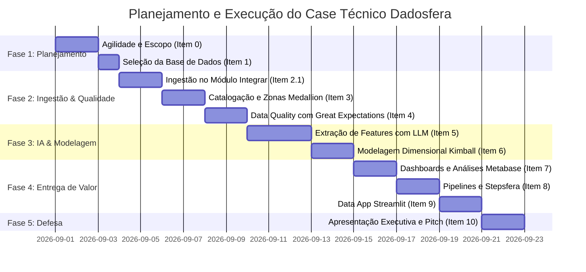

# Case Técnico Dadosfera

Repositório do case técnico de Engenharia de Dados. Os dados gerados são sintéticos e destinados a demonstrar ingestão, qualidade, modelagem e consumo analítico.

## Governança do projeto

O planejamento segue conceitos do PMBOK. A WBS (Work Breakdown Structure) decompõe o escopo em entregas verificáveis, da preparação dos dados à apresentação executiva. A gestão de riscos identifica eventos que podem afetar prazo, qualidade ou acesso e define respostas antes da execução. O caminho crítico é a sequência de atividades dependentes que determina a duração mínima do projeto; atrasos nessa sequência afetam a data final.

### Matriz de riscos

| Risco | Categoria | Impacto | Probabilidade | Mitigação |
|---|---|---|---|---|
| Acesso à plataforma ou permissões indisponíveis | Operacional | Alto | Média | Solicitar acessos no início e manter instruções reproduzíveis para execução manual. |
| Dados sintéticos não representarem os casos esperados | Dados | Médio | Média | Validar distribuições, chaves, nulos e cenários de status antes da ingestão. |
| Datas inválidas ou inconsistentes na ingestão | Qualidade | Alto | Média | Padronizar timestamps na origem e validar tipos e intervalos após a carga. |
| Extração de atributos por LLM produzir conteúdo incorreto | Tecnologia | Alto | Média | Validar saídas com regras, amostras revisadas e rastreabilidade do prompt/modelo. |
| Atraso em tarefas dependentes do caminho crítico | Prazo | Alto | Média | Acompanhar marcos, dependências e bloqueios; priorizar atividades críticas. |

### Cronograma

## Geração dos dados

O notebook [01_data_generation_and_prep.ipynb](notebooks/01_data_generation_and_prep.ipynb) gera três CSVs sintéticos em `data/bronze/`: 100.000 pedidos, 200.000 itens e 5.000 produtos. Os arquivos gerados são locais e ficam fora do controle de versão. Instale as dependências com `pip install -r src/requirements.txt` antes de executar o notebook.

## Ingestão Bronze

No Módulo Integrar da Dadosfera, crie uma conexão para arquivos CSV e carregue `tb_orders.csv`, `tb_order_items.csv` e `tb_products_unstructured.csv`. A consulta de microtransformação solicitada para pedidos está em [clean_orders.sql](pipelines/sql_transformations/clean_orders.sql). Após configurar a conexão e permissões na plataforma, execute a carga e valide o volume e os tipos das colunas.